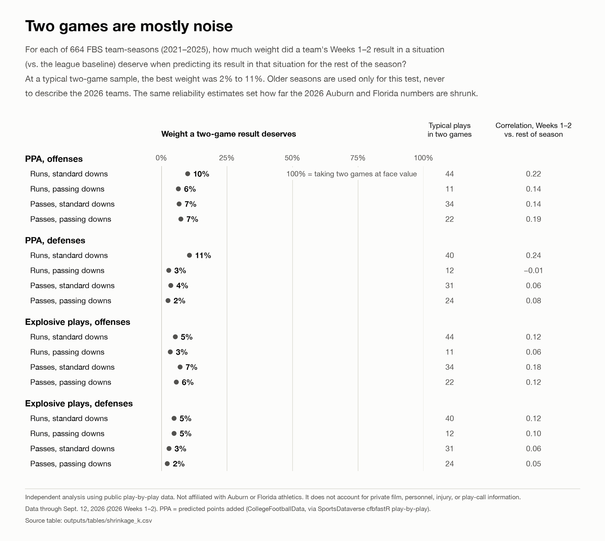
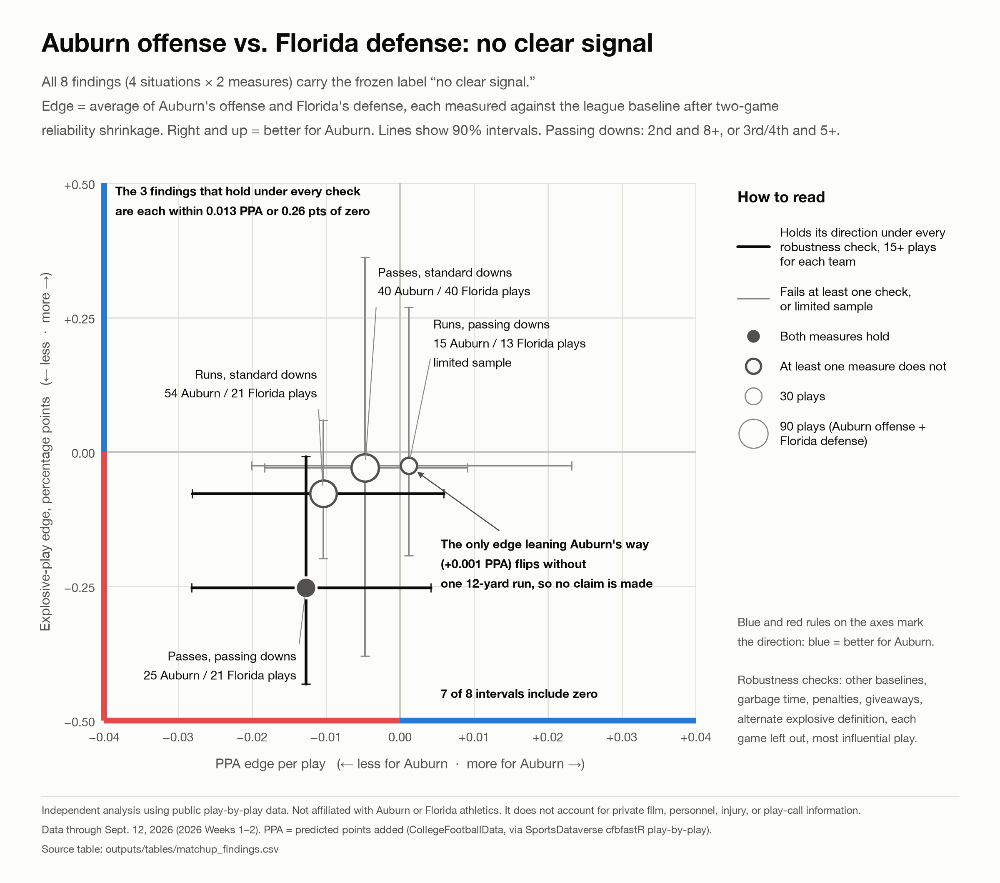
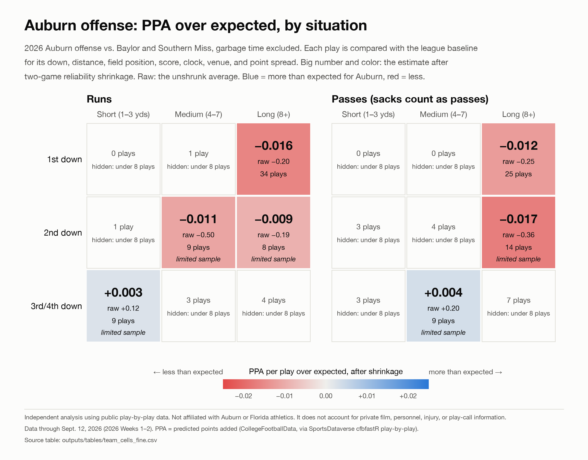
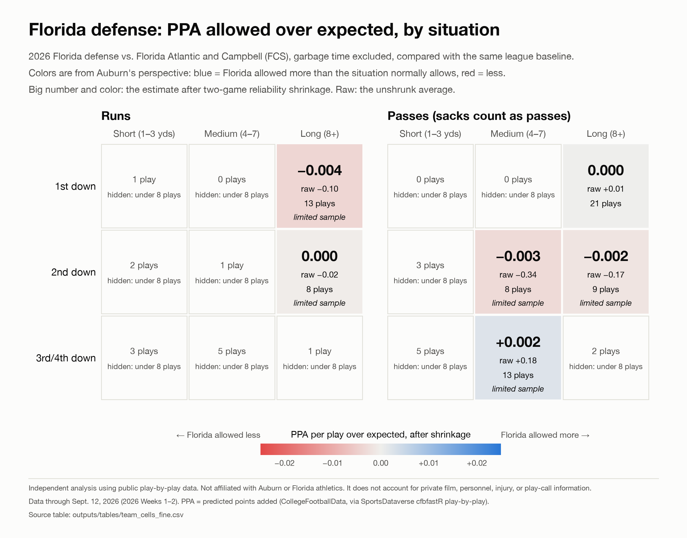
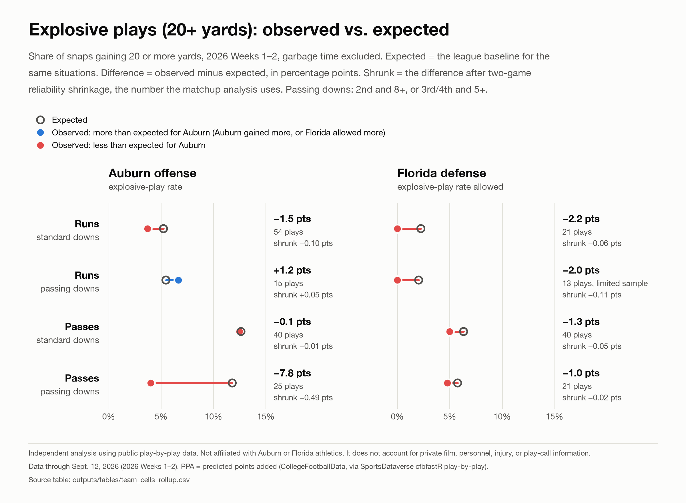

# Finding Auburn's Offensive Edge Against Florida With Play-by-Play Data

> **Independent analysis.** This project uses public play-by-play data. It is not affiliated with Auburn Athletics or Florida Athletics, and it does not account for private film, personnel, injury, or play-call information.

**Data cutoff:** games on or before **September 12, 2026** (Auburn: Baylor, Southern Miss; Florida: Florida Atlantic, Campbell)
**Game:** Auburn vs. Florida, Saturday, September 19, 2026, Jordan-Hare Stadium
**Status:** analysis frozen; no pregame matchup claims ([decision memo](docs/go_no_go.md))

## The question

> In the 2026 season so far, where has Auburn's offense under Alex Golesh produced more value than the situation normally produces, where has Florida's defense under Jon Sumrall allowed more than the situation normally allows, and where do those two patterns overlap?

Value is measured two ways: **PPA** (predicted points added per play) and the **explosive-play rate** (gains of 20+ yards). Instead of predicting the final score, the project builds a league-wide baseline for what each situation normally produces, measures both teams against it, and asks where the patterns overlap.

## The decision

Every rule, threshold, and label was written down before the Auburn and Florida results were computed ([analysis spec](docs/analysis_spec.md), with a dated change log). All five go gates passed. One no-claims trigger fired: **the only situation leaning Auburn's way depends on a single play.** Under the frozen rules, the project makes **no pregame claim** about where Auburn's offense has an edge on Florida's defense.

The pregame write-up is therefore about what two games of data can and cannot tell you (spec change log #14). It makes no situational matchup claims.

## Key results

1. **Two games are mostly noise.** Across 664 FBS team-seasons from 2021 to 2025, a team's regular-season Weeks 1–2 result in a situation correlated with its rest-of-season result at 0.24 or less. At a typical two-game sample, the result deserves 2–11% weight; the rest should come from the league baseline.
2. **No situation shows a clear signal.** All eight matchup findings (4 situations × PPA and explosive plays) carry the frozen label "no clear signal." The only edge leaning Auburn's way, +0.001 PPA per play on 15 and 13 plays, flips if one 12-yard run is removed.
3. **What held up is tiny.** The three findings that keep their direction under every robustness check are each within 0.013 PPA per play, or 0.26 percentage points of explosive-play rate, of zero.

## Figures

| | |
|---|---|
| **Two games are mostly noise** (V5)  | **All eight findings: no clear signal** (V4)  |
| **Auburn offense, PPA over expected** (V1)  | **Florida defense, PPA allowed over expected** (V2)  |
| **Explosive plays, observed vs. expected** (V3)  | |

Every figure uses the same color direction: **blue = better for Auburn** (Auburn's offense produced more, or Florida's defense allowed more), **red = worse**. Cells with fewer than 8 plays are blank, and 8–14 plays are labeled "limited sample." The numbers drawn on each figure are saved next to it as `outputs/figures/*_data.csv` and tested against the analysis tables.

## Data sources

| Source | Used for |
|---|---|
| [SportsDataverse `cfbfastR_cfb_pbp`](https://github.com/sportsdataverse/sportsdataverse-data/releases/tag/cfbfastR_cfb_pbp) (CollegeFootballData plays processed by cfbfastR), 2021–2026 | All play-by-play and the PPA values |
| [CollegeFootballData API](https://api.collegefootballdata.com) (Academic tier) | Game IDs and completion, FBS membership, betting lines, box scores for reconciliation, 2026 context (coaches, returning production, transfers) |
| Official box scores: auburntigers.com (WMT stats feed) and floridagators.com (Sidearm) | Reconciling the four 2026 games |

All 58 raw files are frozen and hashed in [`data/data_manifest.csv`](data/data_manifest.csv). Why each source was chosen or rejected, including why cfbfastR EPA was replaced by PPA: [`docs/data_sources.md`](docs/data_sources.md).

## Method in brief

1. **Clean** 1.3 million raw rows into 612,758 FBS run and pass snaps. The rules remove duplicates, no-plays, accepted-penalty snaps, kneels, spikes, overtime, and invalid states, and they recover snaps the source typed as fumbles or penalties. Garbage time follows the CFBD/Connelly score-margin rule.
2. **Baseline:** ridge regression (PPA) and logistic regression (explosive plays) on pre-snap features only: down, distance, field position, quarter, clock, score, venue, and point spread. They were tuned on 2021–2024, tested once on 2025, and refit on 2021–2025. XGBoost was tested and not chosen because it improved accuracy by less than the 1% bar.
3. **Check the 2026 environment** on 181 other 2026 games before scoring Auburn or Florida. No correction was needed.
4. **Team residuals:** actual minus expected for Auburn's 134 offensive snaps and Florida's 95 defensive snaps outside garbage time, in situations fixed in advance: standard or passing downs × run or pass. Expected includes each game's point spread, so a residual measures a team against that game's expectations, not against an average team.
5. **Shrink** each residual toward the league baseline by an amount learned from how well two early games predicted the rest of the season in 2021–2025.
6. **Edge** = average of Auburn's and Florida's shrunk residuals. Each finding must survive up to 10 robustness checks, including each game left out, the most influential play removed, garbage time included, giveaways removed, and an XGBoost baseline.

Full method: [`docs/methodology.md`](docs/methodology.md) · Model card: [`outputs/model_card.md`](outputs/model_card.md)

## Limitations

- Two games per team: most situation cells are too small to show, and the rest are mostly noise.
- The 90% intervals are descriptive, from a play-level bootstrap. They ignore game-level clustering, so true uncertainty is larger.
- Opponent strength enters only through the point spread. Florida's 51.5-point spread against FCS Campbell is outside the training range.
- There is no formation, personnel, coverage, injury, or play-call data, and run or pass is a coaching choice, so results are associations only.
- Raw data is not in Git, and upstream sources update in season. The ingest step checks every download against the recorded SHA-256 hashes and stops if the upstream data has changed.

Full list: [`docs/limitations.md`](docs/limitations.md)

## Reproduce

Requires Python 3.12. On macOS, XGBoost also needs OpenMP (`brew install libomp`).

```bash
python3.12 -m venv .venv
.venv/bin/pip install -r requirements.txt
cp .env.example .env                  # add a free CollegeFootballData API key (used to download raw files)

.venv/bin/python -m src.ingest        # downloads missing raw files; every file must match its recorded SHA-256
.venv/bin/python -m src.clean         # data/processed/plays.parquet, cleaning waterfall
.venv/bin/python -m src.reconcile     # four 2026 games vs. CFBD and official box scores
.venv/bin/python -m src.models        # baselines, 2025 test, 2026 environment check
.venv/bin/python -m src.matchup       # team profiles, shrinkage, findings, go/no-go
.venv/bin/python -m src.visuals       # figures and the numbers behind them
.venv/bin/python -m pytest
```

Then run `notebooks/01_data_audit.ipynb`, `02_baseline_models.ipynb`, and `03_matchup_analysis.ipynb`.

Raw data is not committed, so a fresh clone downloads all 58 raw files. If any source has changed since the September 16, 2026 snapshot, `src.ingest` stops with a hash mismatch instead of silently using different data.

**Verified September 18, 2026:** a fresh Python 3.12 environment was built from `requirements.txt` and used only the frozen raw files. After the correction below, the full pipeline ran end to end in it in about 4 minutes, all 115 tests passed, and the three notebooks executed without errors. The rerun reproduced byte for byte every table in `outputs/tables/`, the fitted models, the cleaned and scored play files, the figure data, and the figure PNGs. The notebook outputs matched the saved notebooks cell for cell.

## Corrections

- **September 18, 2026, before publication:** the two-game reliability test counted bowl and playoff games as early season, because the play-by-play numbers them week 1. The fix was logged before corrected results were computed ([change log #15](docs/analysis_spec.md)). It changed the reliability numbers (the weight two games deserve went from 2–15% to 2–11%) but no gate, label, or decision. Before and after: [`go_no_go.md`](docs/go_no_go.md#correction-september-18).

## Repository layout

```text
├── README.md
├── requirements.txt
├── data/
│   ├── data_manifest.csv        source, parameters, time, size, and SHA-256 for every raw file
│   ├── raw/                     frozen downloads (not in Git)
│   ├── interim/                 model predictions (not in Git)
│   └── processed/               cleaned snaps (not in Git)
├── docs/
│   ├── analysis_spec.md         frozen rules and change log (binding)
│   ├── data_sources.md
│   ├── go_no_go.md              Thursday decision memo
│   ├── methodology.md
│   ├── limitations.md
│   └── linkedin_post.md
├── notebooks/                   01 data audit · 02 baseline models · 03 matchup analysis
├── outputs/
│   ├── figures/                 PNGs and *_data.csv
│   ├── models/                  fitted baselines and model_selection.json
│   ├── tables/                  every analysis table
│   └── model_card.md
├── src/                         config, ingest, clean, reconcile, features, models, matchup, visuals
└── tests/                       cleaning, features, leakage, matchup, visuals
```

The original project plan is kept in `Auburn_vs_Florida_Offensive_Edge_Project_Plan.md`. Where it differs from the spec, the spec wins.
